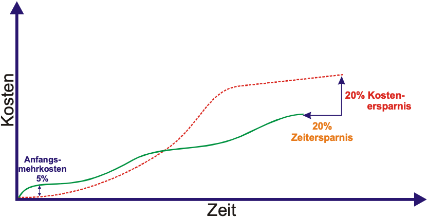

**100er**
=
# Wieso Projekte? Warum werden immer mehr Aufgaben in Projektform abgewickelt?

-  Mehr individuelle Problemlösungen
-  Komplexität der Aufgaben steigt
-  Abteilungsübergreifende Zusammenarbeit möglich
-  Zusammenarbeit auch über Länder und Kontinentsgrenzen hinweg
- Interdisziplinär
- Mit Projektmanagement zur richtigen Problemsicht kommen.

# Was ist ein Projekt (Merkmale)?

- Zielorientierung: genaue inhaltliche Abgrenzung
- Zeitliche terminliche, finanzielle, personelle Begrenzung
- keine Routine, bis zu gewissen Grad einmalig
- Neuartig und Innovation
- Komplexität
- Zusammenarbbeit
- Interdisziplinär
- eigene organisatorische Zuordnung
- Bedeutung für das Unternehmen
- Risiko
- Umfang (Aufwand, Person, Finanzmittel)

Technisch gesehen: ein Projekt ist eine **Aufgabe (Vorhaben)**
- die sich aus einer Vielzahl von einzelnen **Teilaufgaben** (Tätigkeiten, Aktivitäten, Vorgänge) zusammensetzt (UMFANG)
- deren Erfüllung jeweils **Zeit** und andere **Ressourcen (Kapazitäten)** benötigt
- deren **Teilaufgaben** untereinander in **zeitlichen Anordnungsbeziehungen** stehen
- deren **organisatorische Bedürfnisse** sich im **Zeitablauf** ändern

# Nenne die drei Säulen von Projektmanagement

Projektmanagement besteht aus _Organisation_, _Mensch_ und _Methode_

# Was ist die Lehre aus dem Diagramm? (gehe dabei auch auf die Projektphasen ein) 
Anfänglicher Mehraufwand von 5 % führt zu Kosten- und Zeitvorteil von ca. 20 %

# Welche Ebenen des Projektmanagements kann man unterscheiden (Reichweite)

# Welche Phasen hat das einfachste (Mehr-)Phasenmodell?
## a) beschreibe es

1. Ideenphase
2. Vorstudie
3. Projektplanung
4. Projektdurchführung
5. Abschluss

## b) baue es aus um weitere Phasen

1. Ideenphase
2. 

# Welche Aufgaben bestehen in einem Projekt phasenübergreifend(sogenannte "Querschnittsaufgaben")? 

1. Ideenphase
   
2. Vorstudie
    
    feasability studiy, Machbarkeitsstudie, Varianten, Entscheidung
    
    **Querschnittsaufgaben**

    - Kick-off-meeting, Teambildung

3. Projektplanung
    - Definition
    - Analyse
    - Realisierungsplan

    **Querschnittsaufgaben**

    - Teamkommunikation 
    - Stakeholder-Analyse
    - Risikomanagement

4. Projektdurchführung
    
    **Querschnittsaufgaben**

    - Projekt-Controlling
    - Teamkommunikation, Reporting, Doku (wie bei Projektplanung)
    - Stakeholder-Analyse (wie bei Projektplanung)
    - Risikomanagement (wie bei Projektplanung)

5. Abschluss

    Projektabschlussbericht und Evaluierung

# Welche Dokumente werden im Projektablauf gefordert? 

1. Ideenphase
   
    **Dokumente**
        
     * Projektantrag

2. Vorstudie
    **Dokumente**

    - Projektauftrag, Zieldefinition

3. Projektplanung
4. 
    **Dokumente**

    * Meilenstenliste
    * Projektstrukturplan
    * Arbeitspakete
    * Netzplan
    * Stakeholder-Analyse
    * Risikoanalyse

5. Projektdurchführung
  
    Projekt-Controlling

    **Dokumente**

    Berichte zu jedem Meilenstein

6. Abschluss

    **Dokumente**

    * Projektabschlussbericht und Evaluierung

# Welche grundlegenden Prozesse unterscheidet DIN 69901? 

# Skizziere das Prozessmodell der DIN 69901

# Welche Prozessphasen sieht die DIN 69901 in Projektmanagement-Prozessen vor?

# Wozu Projektphasen? 

# Beschreibe die Vorgehensweise im „Unified Process“ 

# Wann ist (wann gilt) eine Projektphase (als) abgeschlossen? 

# Warum Projektmanagement? (Textfolie)

# Welche Projektarten kann man unterscheiden?

# Welche Faktoren sind bei einem Innovationsprojekt besonders ausgeprägt?

# Wie werden Projekte nach relativer Neuigkeit eingeteilt?

# Wie können Projektarten nach dem Ziel des Projektes unterschieden werden?

# Was zeichnet ein Potentialprojekt aus? (WELCHE Faktoren sind WIE ausgeprägt?)

# Was zeichnet ein Akzeptanzprojekt aus? (WELCHE Faktoren sind WIE ausgeprägt?)

# Was zeichnet ein Pionierprojekt aus? (WELCHE Faktoren sind WIE ausgeprägt?)

# Was zeichnet ein Standardprojekt (Routineprojekt) aus? (WELCHE Faktoren sind WIE ausgeprägt?)

# Welche Aufgabenträger sind in einem größeren Projekt neben dem/der Projektleiter*in noch anzutreffen und welche Aufgaben haben bzw. welche Rolle spielen diese?  (NICHT: Arten)

# Welche Eigenschaften muss ein(e) gute(r) Projektleiter*in aufweisen?

# Welche Rollen muss ein(e) gute(r) Projektleiter*in ausfüllen?

# Was sind die Aufgaben eines/einer Projektleiter*in? 

# Wozu dient ein Projektausschuss? (Rolle, Randbedingungen, Zusammensetzung, NICHT: Aufgaben)

# Welche Aufgaben hat ein Projektausschuss? 

# Was versteht man unter "Promotor"? 
## Wozu Promotoren?
## Welche Arten gibt es?

# Wozu Promotoren? Welche Arten gibt es?

# Beschreibe die Methode "Brainstorming"?
## Was ist das?
## Wie ist der Ablauf?
## Worauf ist zu achten?

# Beschreibe die „Methode 635“? 
## Was ist das?
## Wie ist der Ablauf?
## Worauf ist zu achten?

# Was geschieht, wenn ein Projektteam die "Methode 635" anwendet? (ankreuzen)

# Beschreibe die Methode „Synektik“? 
## Was ist das?
## Wie ist der Ablauf?
## Worauf ist zu achten?

# Beschreibe die Methode Morphologie? 
## Was ist das?
## Wie ist der Ablauf?
## Worauf ist zu achten?

# Beschreibe die Methode Mindmapping? 
## Was ist das?
## Wie ist der Ablauf?
## Worauf ist zu achten?

# Beschreibe die Methode Bionik?
## Was ist das?
## Wie ist der Ablauf?

# Beschreibe die Methode Standard-Delphi?
## Was ist das?
## Wie ist der Ablauf?
## Worauf ist zu achten?

# Was ist der Unterschied zwischen Standard- und Breitband Delphi? 

# Welche Ebenen gehören zu einem ganzheitlichen Projektmanagement?

# Nenne allgemeine Spielregeln für erfolgreiche  Kommunikation? (NICHT: Teamarbeit)

# Nenne allgemeine Spielregeln für erfolgreiche Teamarbeit? (NICHT: Kommunikation) 

# Was sind Serifen? Wo sollte man sie nicht verwenden?  

# Welche unfaire Taktiken werden oft in Verhandlungen eingesetzt und wie begegnet man dem am besten?
